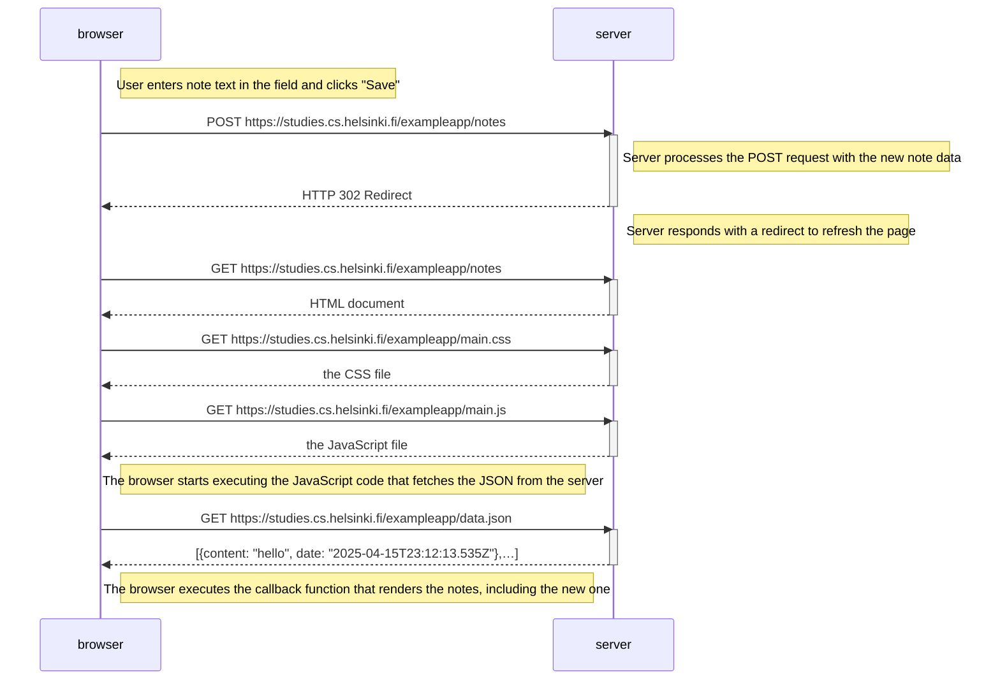

```mermaid

sequenceDiagram

    participant browser

    participant server

    Note right of browser: User enters note text in the field and clicks "Save"

    browser->>server: POST https://studies.cs.helsinki.fi/exampleapp/notes

    activate server

    Note right of server: Server processes the POST request with the new note data

    server-->>browser: HTTP 302 Redirect

    deactivate server

    Note right of server: Server responds with a redirect to refresh the page

    browser->>server: GET https://studies.cs.helsinki.fi/exampleapp/notes

    activate server

    server-->>browser: HTML document

    deactivate server

    browser->>server: GET https://studies.cs.helsinki.fi/exampleapp/main.css

    activate server

    server-->>browser: the CSS file

    deactivate server

    browser->>server: GET https://studies.cs.helsinki.fi/exampleapp/main.js

    activate server

    server-->>browser: the JavaScript file

    deactivate server

    Note right of browser: The browser starts executing the JavaScript code that fetches the JSON from the server

    browser->>server: GET https://studies.cs.helsinki.fi/exampleapp/data.json

    activate server

    server-->>browser: [{content: "hello", date: "2025-04-15T23:12:13.535Z"},…]

    deactivate server

    Note right of browser: The browser executes the callback function that renders the notes, including the new one

```
