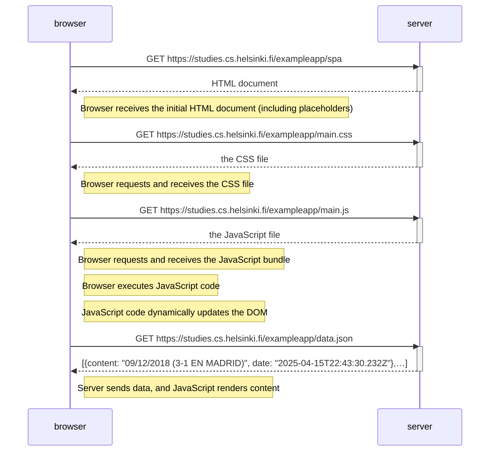

```mermaid

sequenceDiagram

    participant browser

    participant server

    browser->>server: GET https://studies.cs.helsinki.fi/exampleapp/spa

    activate server

    server-->>browser: HTML document

    deactivate server

    Note right of browser: Browser receives the initial HTML document (including placeholders)

    browser->>server: GET https://studies.cs.helsinki.fi/exampleapp/main.css

    activate server

    server-->>browser: the CSS file

    deactivate server

    Note right of browser: Browser requests and receives the CSS file

    browser->>server: GET https://studies.cs.helsinki.fi/exampleapp/main.js

    activate server

    server-->>browser: the JavaScript file

    deactivate server

    Note right of browser: Browser requests and receives the JavaScript bundle

    Note right of browser: Browser executes JavaScript code

    Note right of browser: JavaScript code dynamically updates the DOM

    browser->>server: GET https://studies.cs.helsinki.fi/exampleapp/data.json

    activate server

    server-->>browser: [{content: "09/12/2018 (3-1 EN MADRID)", date: "2025-04-15T22:43:30.232Z"},…]

    deactivate server

    Note right of browser: Server sends data, and JavaScript renders content

```
