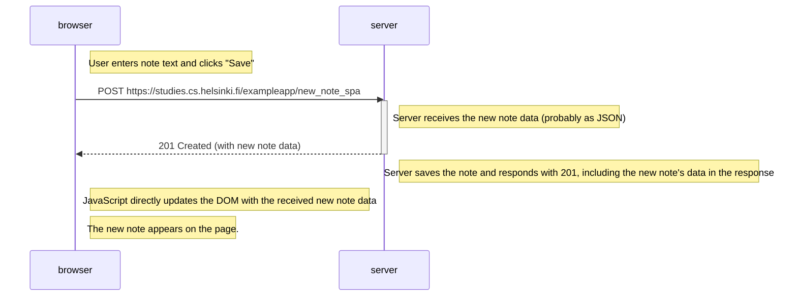

```mermaid

sequenceDiagram

    participant browser

    participant server

    Note right of browser: User enters note text and clicks "Save"

    browser->>server: POST https://studies.cs.helsinki.fi/exampleapp/new_note_spa

    activate server

    Note right of server: Server receives the new note data (probably as JSON)

    server-->>browser: 201 Created (with new note data)

    deactivate server

    Note right of server: Server saves the note and responds with 201, including the new note's data in the response

    Note right of browser: JavaScript directly updates the DOM with the received new note data

    Note right of browser: The new note appears on the page.

```
