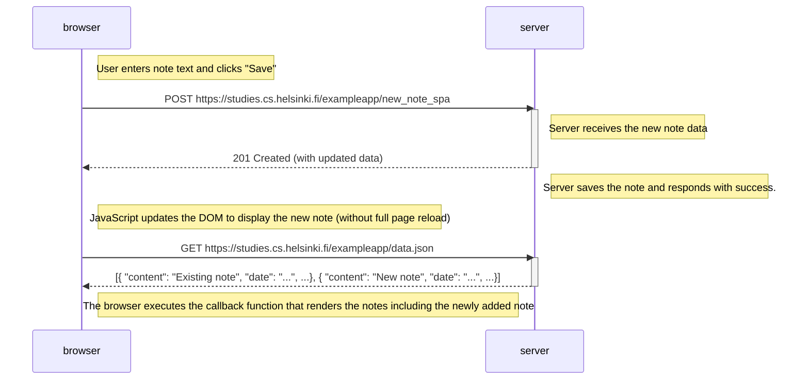

```mermaid

sequenceDiagram

    participant browser

    participant server

    Note right of browser: User enters note text and clicks "Save"

    browser->>server: POST https://studies.cs.helsinki.fi/exampleapp/new_note_spa

    activate server

    Note right of server: Server receives the new note data

    server-->>browser: 201 Created (with updated data)

    deactivate server

    Note right of server: Server saves the note and responds with success.

    Note right of browser: JavaScript updates the DOM to display the new note (without full page reload)

    browser->>server: GET https://studies.cs.helsinki.fi/exampleapp/data.json

    activate server

    server-->>browser: [{ "content": "Existing note", "date": "...", ...}, { "content": "New note", "date": "...", ...}]

    deactivate server

    Note right of browser: The browser executes the callback function that renders the notes including the newly added note

```
